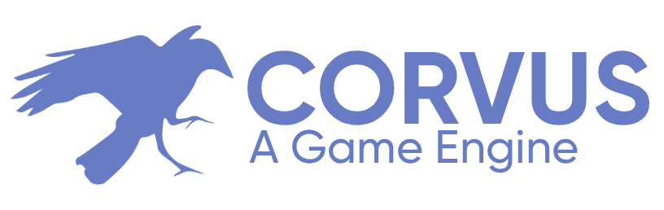
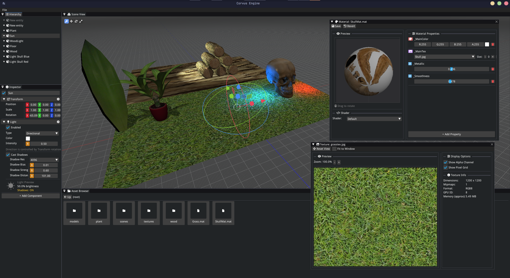

  

> [!NOTE]
> **Work in Progress**
> This engine is under active development as a fun side project

A full-featured game engine built on top of [raylib](https://www.raylib.com/), designed for creating 3D games with a complete development workflow.

## Editor Preview

## Features

- **Raylib Backend** - Leverages raylib for graphics and input handling
- **Built-in Editor** - Integrated editor interface
- **Mature Asset System** - Comprehensive asset loading and management pipeline
- **Scripting Support** *(planned)* - Full scripting capabilities with Wren coming soon

## Current Status

Corvus is being developed for fun and learning, with the goal of becoming a full-featured game engine. While currently lightweight in memory usage, the aim is to provide a complete suite of professional game development tools.

## Getting Started

*(Coming soon)*